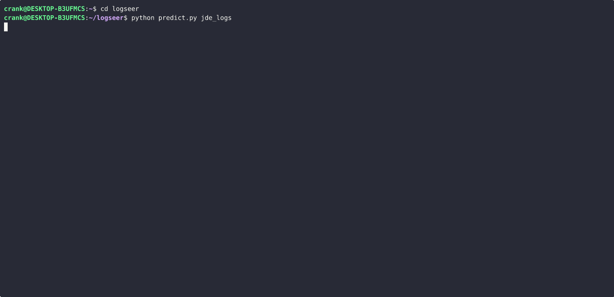

# LogSeer

Predict failures **before they happen** — and avoid costly failures entirely.

LogSeer predicts whether a deployment, batch job, or other critical operation will fail — **before it starts** — allowing you to take preventive action instead of waiting for a failure and recovery cycle.

In real enterprise environments, failures are often not caused by broken systems, but by transient system state. Operations run, hang, and fail — wasting time and requiring manual recovery.

LogSeer reads your server logs, assesses the current system state, and flags high-risk operations in advance.

Validated at ~80% precision on ~10% of failures in the reference environment after tuning on real system data.



## Overview

Large enterprise systems — ERP platforms, middleware, batch processing infrastructure — run on multiple servers that continuously emit logs reflecting the current system state. When a critical operation such as a deployment or batch job is initiated, it sometimes fails — not because the system is broken, but because its current state is incompatible with that particular operation succeeding. These failures are often costly: the operation may run for a long time before hitting an error or timeout, and recovery requires intervention and a re-attempt.

LogSeer reads those logs, assesses the current system state, and predicts whether a planned operation will succeed or fail — **before it is initiated**. If failure is predicted, a preventive action can be taken before the operation starts — such as holding the operation, rescheduling, or restarting the system — avoiding the costly failure entirely.

It is designed to generalize to any system and any operation type. Oracle JD Edwards (JDE) EnterpriseOne serves as the primary implementation and validation environment.

## Quick Start

Google Colab requires no local setup. The self-hosted notebook and CLI options require Python 3 and the dependencies in `requirements.txt`.

### Google Colab

The notebooks clone the repo from GitHub automatically — no manual setup needed.

**Training**

[](https://colab.research.google.com/github/masahiko-shibata/logseer/blob/main/notebooks/train.ipynb)

1. Open `notebooks/train.ipynb` in Colab using the badge above — set the hardware accelerator to GPU first with the pull down menu on the right top (**Connect > Change runtime type > Hardware accelerator > GPU**), otherwise training will be very slow
2. Upload your training data as `data.zip` to `My Drive/Colab Notebooks/logseer/data/` in Google Drive — the notebook header describes the required folder structure. Store `error` and `success` directories under `data/` folder and zip the folder itself (the zip should extract to a `data/` folder).
3. Run the **Setup** cell — it clones the repo automatically on first run
4. Run the **Data copy from Google Drive** cell (Colab-only) to load your data
5. Adjust the **Configuration** cell if needed, then run the **Training loop** cell
6. Run the **Copy model files to Google Drive** cell (Colab-only) to save trained models to `My Drive/Colab Notebooks/logseer/models/`

**Inference**

[](https://colab.research.google.com/github/masahiko-shibata/logseer/blob/main/notebooks/predict.ipynb)

1. Ensure trained model files (`logseer.keras`, `tokenizer.pickle`, `xgb.pkl`) are in `My Drive/Colab Notebooks/logseer/models/`
2. Upload your log data as `data_current.zip` to `My Drive/Colab Notebooks/logseer/data/`
3. Open `notebooks/predict.ipynb` in Colab using the badge above and run the **Setup** cell
4. Adjust thresholds in the **Configuration** cell if needed
5. Run the **Copy data and trained models from Google Drive** cell (Colab-only), then run **Load models and predict**

### Self-hosted Notebook
1. Under a directory where your Notebook is started, `git clone https://github.com/masahiko-shibata/logseer.git` and `cd logseer` then `pip install -r requirements.txt`
2. Open `notebooks/train.ipynb`, set `DATA_DIR` in the Configuration cell, and run all cells, skipping the Colab-only Drive cells — the notebook header describes the required folder structure
3. For inference, open `notebooks/predict.ipynb`, set `DATA_DIR` in the Configuration cell, and run

### CLI
1. `git clone https://github.com/masahiko-shibata/logseer.git` and `cd logseer` then `pip install -r requirements.txt`
2. Place your log data under the logseer root in `data/error/` and `data/success/` (or pass `data_dir=` as an override)
3. Train:
   ```bash
   python train.py data_dir=your_data
   ```
   Any config key can be overridden as `key=value` (e.g. `model_name=LogCNNv2 epochs=60`). Trained models are saved to the project root.
4. Run prediction:
   ```bash
   python predict.py /path/to/your/logs
   ```

## Problem

In large enterprise environments, a failed operation typically follows this pattern:

1. An operation (deployment, batch job, etc.) is initiated on a system that is running normally
2. An underlying state issue causes it to fail — either by hitting an error partway through, or by running until a timeout
3. Recovery is required — the specific action depends on the system and operation
4. The operation is re-attempted after recovery

If the system state can be assessed from logs **before the operation starts**, the failure can be avoided entirely.

### Prediction, not detection

Most log-based ML systems perform anomaly *detection* — they analyze logs produced during or after an event to identify that something has already gone wrong. LogSeer is fundamentally different: it performs *prediction*. The logs it reads do not contain the failure. They contain the latent system state that will cause a future operation to fail. The label is the outcome of an operation that has not yet started.

This makes the problem harder — there is no explicit error signal in the input — but also more valuable, as the failure can be prevented entirely rather than just identified after the fact.

| Outcome | Cost |
|---|---|
| False Negative (missed failure) | Full timeout + review + restart + re-attempt |
| False Positive (false alarm) | Unnecessary restart and service disruption |

The relative cost ratio between FN and FP depends on the system and operational context. A missed failure (FN) may result in a costly timeout and recovery cycle, or may resolve itself depending on the nature of the failure. A false alarm (FP) would trigger an unnecessary preventive action such as a restart. The right operating point depends on which cost dominates in your environment — use the threshold sweep tables to explore the tradeoff.

Note: the JDE results were obtained in shadow mode — predictions were made but no automated action was taken. The example results are tuned for F1 as a neutral baseline; however, the high-precision operating points described in the Results section may make a practical alert or restart signal depending on restart cost tolerance.

## Approach

LogSeer ingests pre-collected log files from all relevant servers, combines them into a single representation of the current system state, and classifies it as predicted success or predicted failure.

The pipeline includes:

- **Multi-file log ingestion** — log files from multiple server processes are combined per operation into a single text representation
- **Domain-aware preprocessing** — timestamps, IDs, IP addresses, and other high-cardinality tokens are normalized to reduce noise while preserving meaningful signal
- **LogCNNv2** — a deep dilated 1D CNN that performed best in comparison against RNN-based models (LSTM, GRU, biLSTM, biGRU) and shallower CNN variants. Notably, this is a convolutional architecture more commonly associated with image processing, applied here to log token sequences — sequential models underperformed, suggesting the signal in these logs is not strongly order-dependent at the token level
- **XGBoost** — a TF-IDF based classifier that captures anomalous token occurrence patterns
- **Ensemble** — each model outputs a failure probability score. The OR signal fires if either score exceeds its threshold; the AND signal fires only if both do. CNN and XGBoost are intentionally complementary — XGBoost detects anomalies through token frequency and TF-IDF signals; the CNN captures sequential and contextual patterns. They are expected to miss different errors, and the ensemble value comes from that disagreement. Both models consistently identify distinct failure cases the other misses — CNN-only and XGBoost-only true positives appear in every evaluation run.
- **Repeated evaluation** — randomized train/test splits (configurable, default 100) with Fisher's exact significance testing for statistically reliable performance estimates
- **Token importance analysis** — XGBoost token importance was analyzed across the reference environment. No individual tokens stood out as dominant failure indicators — the signal is diffuse across many tokens rather than concentrated in a few. This is a key motivation for an ML approach: there is no simple grep rule that captures failure state

> Note: log collection from live servers is handled by a separate pipeline outside this repository. This codebase assumes logs have already been collected and organized into the data directory structure described below.

## JDE Reference Implementation

The current implementation is built around Oracle JD Edwards EnterpriseOne, a large-scale ERP platform widely used in enterprise environments. This was validated in a large, live JDE environment with hundreds of concurrent developers and QA engineers.

- Package deployments happen multiple times per day
- A failed deployment times out after ~30 minutes and must be re-attempted after recovery
- Recovery (restart + re-deploy) takes approximately 15 minutes of additional downtime

Before each deployment, LogSeer reads the current JDE server logs from all running kernel processes and predicts whether the deployment will succeed. If failure is predicted, a preventive system restart could be initiated before the deployment to avoid the timeout. During validation, the system ran in shadow mode — predictions were made but no automated action was taken.

## Results

The following results are from evaluation on a private dataset. Performance will vary across environments — even systems using the same log format (e.g. other JDE installations) may have different failure signatures depending on their configuration, workload, and history. **Training on your own data is required** — no pre-trained models are included in this repository.

Individual model results (100-repetition aggregate, 1000 error samples):

| Model | Precision | Recall | F1 |
|---|---|---|---|
| LogCNNv2 | 0.683 | 0.157 | 0.255 |
| XGBoost | 0.615 | 0.312 | 0.414 |

The CNN has higher precision than XGBoost but catches only 15% of failures. XGBoost has broader coverage and catches many cases the CNN misses. Overlap between the two is 112/1000 errors; 45 are CNN-only and 200 are XGBoost-only true positives.

| Ensemble | NN_t | SKL_t | Precision | Recall | F1 |
|---|---|---|---|---|---|
| OR max recall | 0.50 | 0.50 | 0.439 | 0.407 | 0.422 |
| OR peak F1 | 0.82 | 0.50 | 0.595 | 0.364 | 0.452 |
| AND high-precision | 0.86 | 0.70 | 0.813 | 0.100 | 0.178 |

**OR max recall**: (NN=0.50, XGB=0.50) → precision=0.439, recall=0.407. The highest recall — at the default threshold of 0.50. Catches 4 in 10 failures at the cost of lower precision.

**OR peak F1**: F1=0.452 at (NN=0.82, XGB=0.50) — approximately 0.04 above XGBoost alone. Use as a reference point; tune thresholds toward recall or precision depending on your operational priorities.

**AND high-precision**: (NN=0.86, XGB=0.70) → precision=0.813, recall=0.100. When both models agree, the alert has high precision (~81%), making it suitable as a conservative automated restart signal.
Thresholds are configurable via `nn_threshold` and `sklearn_threshold` in `config.yaml`. The sweep tables printed during training show the full OR and AND tradeoff surfaces.

The ensemble gain over individual models is consistent across all evaluation runs, confirming the complementarity is structural rather than a sampling artifact.

## Project Structure

```
logseer/
├── logseer/
│   ├── loader.py             # Log file loading and preprocessing
│   ├── models.py             # CNN, RNN, and attention-based model architectures
│   ├── trainer.py            # Training loop, sklearn models, ensemble reporting
│   ├── tester.py             # Model evaluation and result accumulation
│   ├── checkpoints.py        # Custom Keras checkpoint callbacks
│   ├── seer.py               # Inference class (Seer) used by predict.py and notebooks
│   └── __init__.py
├── notebooks/
│   ├── train.ipynb           # Training pipeline
│   ├── predict.ipynb         # Inference on new log sets
│   └── token_importance.ipynb # XGBoost token importance analysis
├── train.py                  # CLI training script
├── predict.py                # CLI prediction script (exit 0=OK, 1=ALERT, 2=RESTART)
├── tune_threshold.py         # Threshold tuning utility
├── config.yaml               # Default configuration
├── example_test_result.txt   # Example training output with threshold sweep tables
└── requirements.txt
```

## Data Format

Training data is organized by operation outcome:

```
data/
├── error/
│   ├── 1001/   ← failed operation (one or more log files)
│   ├── 1002/
│   └── ...
└── success/
    ├── 2001/   ← successful operation (one or more log files)
    ├── 2002/
    └── ...
```

Each subdirectory contains the log files collected before a single operation run. Multiple log files per run are supported and combined during preprocessing.

Subdirectory names can be any string. If they are integers, the `TO_ID` configuration option can be used to filter operations by ID range — otherwise leave `TO_ID` at its default.

**Minimum data requirements** — with default settings, 10 error samples are needed for the test split alone, making ~100 error samples a practical lower bound for meaningful results. Training with only a handful of errors is possible with tuning but could produce unreliable estimates — the fewer the errors, the more each individual case dominates the result.

## Training

A GPU is not required, but is strongly recommended for NN training. With a ~1,500-operation dataset (~1GB) and default settings, expect several hours on a Colab T4 GPU. A faster GPU (Colab A100 or a mid-range consumer GPU) reduces this to around 4 hours. CPU-only NN training takes too long to be practical on Colab as sessions time out — use a self-hosted machine if running without a GPU. Sklearn-only training (`TEST_NN = False`) completes in minutes without a GPU.

Use `notebooks/train.ipynb` for an interactive workflow, or `train.py` for CLI-based training:

```bash
python train.py data_dir=your_data
```

Any config key can be overridden as `key=value`. See `config.yaml` for all options.

Two optional notebook cells handle Google Drive integration for Colab users (loading data and saving the trained model). Skip these when running on a self-hosted environment.

### Two-phase workflow

**Phase 1 — Model tuning** (`REPETITION = 100`, `VALIDATE_ON_TEST_DATA = False`)

Run many repeated train/test splits to evaluate model architecture and hyperparameters under varied data conditions. Results are aggregated across all repetitions to produce statistically stable performance estimates. Use this phase to tune `MODEL_NAME`, `EPOCHS`, `LEARNING_RATE`, etc.

**Phase 2 — Production model generation** (`REPETITION = 1`, `VALIDATE_ON_TEST_DATA = True`)

Once tuning is complete, run a single pass with the full training set and validate on held-out test data. This produces the model files and a tokenizer file used in production inference.

### Why repeated splits?

Repetition is particularly important when failure examples are scarce. In the JDE reference environment, 116 failure cases were collected over an extended period — small by ML standards but costly to collect given how rarely failures occur in practice — small enough that a single train/test split is heavily influenced by which examples land where by chance. Repeating with different random splits averages out this variance and gives a more reliable estimate of true model performance.

### Key configuration options

```python
MODEL_NAME            = 'LogCNNLite'  # neural network model architecture to train
REPETITION            = 100           # number of repeated train/test splits (set to 1 for production)
VALIDATE_ON_TEST_DATA = False         # set to True for production model generation
EPOCHS                = 60
NUM_CHAR              = 3000          # characters read from tail of each log file
TO_ID                 = 6000          # upper bound of operation IDs to include (requires integer-named data folders)
TEST_NN               = True          # set to False to skip NN and run sklearn only (CPU-friendly)
SKLEARN_MODELS        = 'xgb'         # sklearn models to train: 'xgb', 'svm', 'rf' (comma-separated)
```

## Prediction

After training, model files (`logseer.keras`, `tokenizer.pickle`, and the sklearn model file e.g. `xgb.pkl`, `rf.pkl`) are saved to the project root automatically. If using Colab, they are saved to Google Drive and can be retrieved from there.

For an interactive workflow, use `notebooks/predict.ipynb` — open it in Colab using the badge in the Quick Start section, or run it on a self-hosted Jupyter environment. Set `DATA_DIR` in the Configuration cell to point to your log data and run all cells.

For CLI use:

```bash
python predict.py /path/to/logs
```

The input directory should contain one subdirectory per operation run, each holding its log files — the same structure as the training data, without the `error/` / `success/` split.

**Diagnostic scan** — multiple log sets, e.g. to review recent history:

```
  Set          NN_prob   XGB_prob      OR    AND  Note
  --------------------------------------------------------------------------
  20240501    0.9721     0.8803     ERR     ERR  RESTART
  20240502    0.4102     0.2914      ok      ok  OK
```

**Automated pre-operation check** — single log set, for use in deployment pipelines:

```
  Set          NN_prob   XGB_prob      OR    AND  Note
  --------------------------------------------------------------------------
  20240501    0.9721     0.8803     ERR     ERR  RESTART

OUTCOME: RESTART  (AND ensemble triggered — hold deployment)
```

Exit codes (single-set mode only), for automation (e.g. Rundeck):

| Code | Meaning |
|------|---------|
| `0`  | OK — both models below threshold |
| `1`  | ALERT — OR triggered, monitor closely |
| `2`  | RESTART — AND triggered, hold deployment |

### Thresholds

Thresholds are set in `config.yaml`:

```yaml
nn_threshold: 0.5
sklearn_threshold: 0.5
```

Choose an operating point based on your cost tolerance — see the Results section for reference values and `example_test_result.txt` for the full sweep.

## Requirements

```bash
pip install -r requirements.txt
```

## Status

The core modeling approach and evaluation methodology are complete and validated.

- Validated in a real enterprise environment using production logs
- Predictions evaluated against actual outcomes in shadow mode
- Architecture and results are stable across repeated evaluation

The results shown here were achieved with a limited dataset from a single environment. With more data, longer collection periods, and broader operation coverage, LogSeer can be tuned toward higher performance across varied operation types.